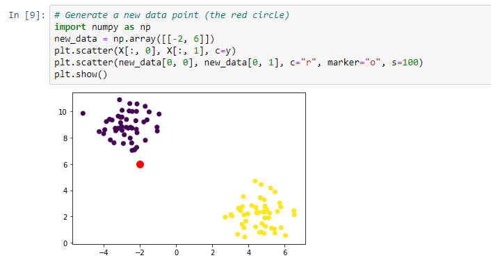
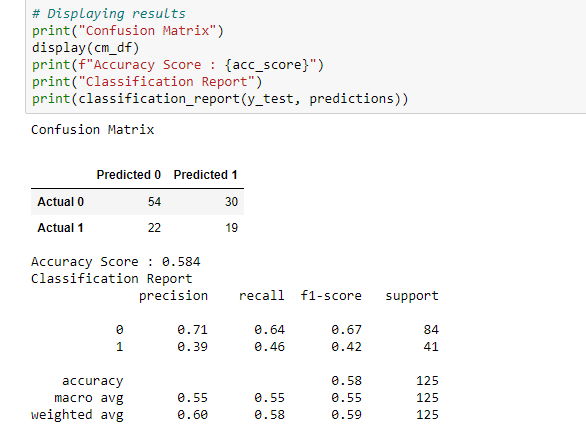
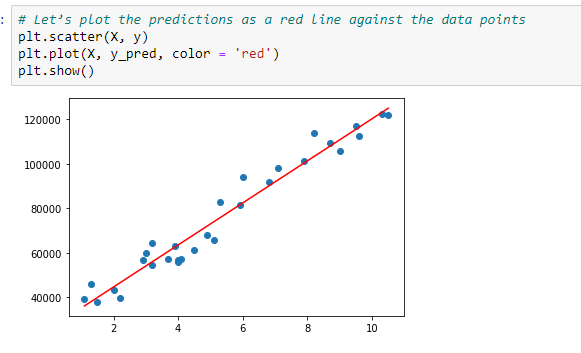
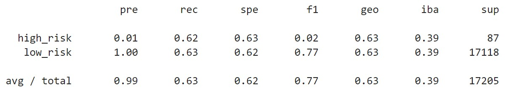
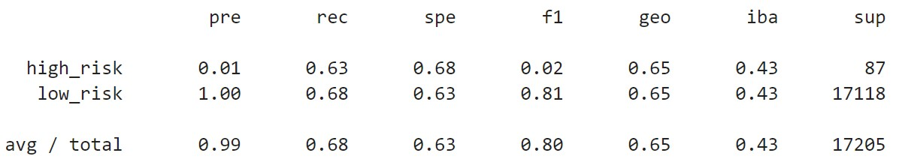
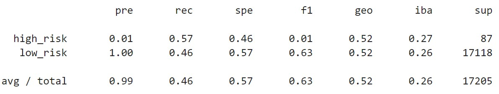
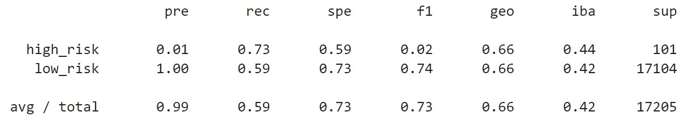

# Credit Risk Analysis

## Description
There is record-breaking number of Americans with unsecured loans. In 2019, more than 19 million Americans had at least one unsecured personal loan. Personal lending is growing faster than credit card, auto, mortgage, and even student debt. With such incredible growth, FinTech firms are storming ahead of traditional loan processes. By using the latest machine learning techniques, these FinTech firms can continuously analyze large amounts of data and predict trends to optimize lending.

### Challenge Overview
Using Python to build and evaluate several machine learning models, predict credit risk using the machine learning algorithms to help banks and financial institutions predict anomalies, reduce risk cases, monitor portfolios, and provide recommendations on what to do in cases of fraud.

### Approach
* Machine learning is the use of statistical algorithms to perform tasks such as learning from data patterns and making predictions.
    * Supervised learning deals with labeled data, and there are two forms.
    In supervised learning, the labels provide the correct answers.
        * Regression is used to predict continuous variables. The regression model’s algorithms attempt to learn patterns that exist    
          among factors given. If presented with new data, the model will make a prediction, based on previously learned patterns from 
          the dataset.

        * Classification is used to predict discrete outcomes. The classification model’s algorithms attempts to learn patterns from  
          the data, and if the model is successful, gain the ability to make accurate predictions.
    
    * Unsupervised learning algorithms work with datasets without labeled outcomes.
  
* Training and testing groups from a given data set.
    * Training dataset to learn from it.
    * Testing dataset to assess its performance.
    
* Implement the logistic regression, decision tree, random forest, and support vector machine algorithms.
    * Logistic regression predicts binary outcomes, meaning that there are only two possible outcomes.
    * Decision trees are used in decision analysis.
    * Random Forests does not have a complex tree like the ones created by decision trees, a random forest algorithm will sample the 
      data and build several smaller, simpler decision trees. Each tree is simpler because it is built from a random subset of features.
    * Support vector machine (SVM), like logistic regression, is a binary classifier. It can categorize samples into one of two 
      categories. There is a strict cutoff line that divides one classification from the other.
      
 * Interpret the results of the logistic regression, decision tree, random forest, and support vector machine algorithms.
 * Compare the advantages and disadvantages of each supervised learning algorithm.
 * Determine which supervised learning algorithm is best used for a given data set or scenario.
 * Use ensemble and resampling techniques to improve model performance.
 

### Results
* Classification Model
  

* Decision Tree
  

* Linear Regression
  

### Things I Learned
* Explain how a machine learning algorithm is used in data analytics.
* Create training and test groups from a given data set.
* Implement the logistic regression, decision tree, random forest, and support vector machine algorithms.
* Interpret the results of the logistic regression, decision tree, random forest, and support vector machine algorithms.
* Compare the advantages and disadvantages of each supervised learning algorithm.
* Determine which supervised learning algorithm is best used for a given data set or scenario.
* Use ensemble and resampling techniques to improve model performance.

### Software/Tools
Python and Scikit-learn

### Challenge Results
Building and evaluating several machine learning models to assess credit risk, includes: Training a logistic regression classifier, calculating the balanced accuracy score, generating a confusion matrix and printing the classification report.

### Summary and analysis of the models’ performance:

#### Random OverSampling

In random oversampling, instances of the minority class are randomly selected and added to the training set until the majority and minority classes are balanced. The accuracy score measures the performance of a classifier, so for a score of 64% in this model the performance of the classifier isn't that impressive. Though accuracy is not a good metric when the data is imbalanced. Precision and recall show low values as well, and a low precision means there are more false positives in the data. For the True Positive Rate (recall) it measures the classifier's completeness, and therefore a low value recall such as above, indicates a high number of false negatives 

#### SMOTE 

While recall values in the SMOTE model, is a little better in the low-risk pool than in the random-oversampling, it is not by much. Like the Random Oversampling, precision is dismal, meaning in both risk pools meaning there are a lot of false positives (precision) and false negatives(recall) in this data as well. The balanced accuracy score is about 66%, not much greater than that in the previous model.

In both Oversampling examples above (SMOTE & Random Over Sampling) it is important to note that one model does not outperform the other. In fact, their metrics and performance are about the same. Plus, SMOTE is vulnerable to outliers.

#### Cluster Centroids Algorithm

Similar to SMOTE is the Cluster Centroids Algorithm/Model. Centroids represents the clusters of generated data points of a majority class. With balanced accuracy metric approximating 66% the performance of the classifier is very similar to that of the SMOTE model. 
The one conclusion is that resampling does not guarantee better results.

#### SMOTEENN Algorithm

In SMOTEENN we see that some of the metrics show an improvement. The recall for the high-risk pool example, is 72% that is the highest we have seen in all 4 sample models. The precision metrics is same as indicated in all 3 other models. The accuracy score is also approximately 66%.

#### Final Recommendation
The above metrics are so very similar throughout the different models, it is almost impossible to recommend one over the other.
That said, I would recommend the SMOTEENN algorithm since that combines aspects of both the oversampling and undersampling, which eliminates some of the challenges found in solely oversampling or undersampling alone. 
